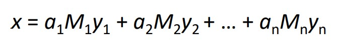

# crt-solver
Repo ini merupakan bagian frontend dari website crt solver, website dibuat dengan frontend vue.js, dan menggunakan backend express.js, semua perhitungan dilaksanakan pada backend, dan pada bagian frontend hanya menerima persamaan persamaan modulo saja.

Frontend dan backend dideploy dengan menggunakan bantuan Azure dan CI/CD dilakukan setiap kali push terhadap branch main / master dilakukan, pada frontend dan backend sama sama dilakukan build dan deploy ketika build dilakukan, untuk menentukan apakah kode yang dibuat sudah dapat langsung terupdate pada link deployment dibawah.

Perhitungan Chinese Remainder theorem akan menggunakan rumus 

dimana nilai M dan y akan dicari pada backend, namun belum tentu semua persoalan crt memiliki solusi, jika ternyata persamaan yang ada tidak dapat memberikan solusi maka akan ditampilkan pesan "Tidak ada Jawaban"

# How to use
1. Untuk Menjalankan pada local jalankan `yarn install` dan `yarn serve`
2. Website sudah di deploy pada link berikut : https://purple-rock-0927ae000.azurestaticapps.net/
3. Persamaan yang dapat diinputkan akan terbagi menjad 3 bagian :
- a x ≡ b mod c
  - Koefisien x (a)
  - Remainder (b)
  - Modulo (c)
4. Website dapat menerima banyak persamaan modulo, dan koefisien x bernilai default 1, namun dapat diubah dengan syarat persamaan modulo tersebut dapat disederhanakan menjadi bentuk 1x
5. Persamaan yang sudah ditambahkan dapat dihapus dengan menggunakan icon silang yang tersedia di kanan persamaan
6. Untuk mendapatkan langkah pengerjaan dan jawaban, tekan tombol Get Answer, setelah mengisikan persamaan-persamaan yang ingin dicari nilai x nya.

# Author
Alexander - 13519090
